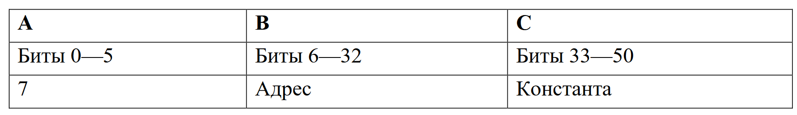
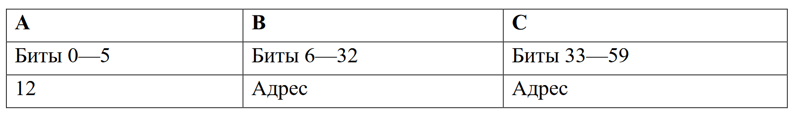
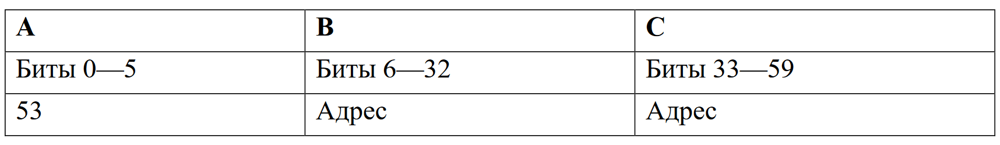
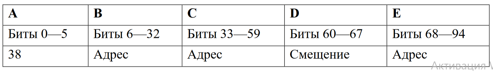

# Задание:

Разработать ассемблер и интерпретатор для учебной виртуальной машины
(УВМ). 

Система команд УВМ представлена далее.


Для ассемблера необходимо разработать читаемое представление команд
УВМ. Ассемблер принимает на вход файл с текстом исходной программы, путь к
которой задается из командной строки. Результатом работы ассемблера является
бинарный файл в виде последовательности байт, путь к которому задается из
командной строки. Дополнительный ключ командной строки задает путь к файлу-
логу, в котором хранятся ассемблированные инструкции в духе списков
“ключ=значение”, как в приведенных далее тестах.

Интерпретатор принимает на вход бинарный файл, выполняет команды УВМ
и сохраняет в файле-результате значения из диапазона памяти УВМ. Диапазон
также указывается из командной строки.

Форматом для файла-лога и файла-результата является json.

Необходимо реализовать приведенные тесты для всех команд, а также
написать и отладить тестовую программу.

## Загрузка константы



Размер команды: 12 байт. Операнд: поле C. Результат: значение в памяти по
адресу, которым является поле B.

Тест (A=7, B=447, C=182):

0xC7, 0x6F, 0x00, 0x00, 0x6C, 0x01, 0x00, 0x00, 0x00, 0x00, 0x00, 0x00

## Чтение значения из памяти



Размер команды: 12 байт. Операнд: значение в памяти по адресу, которым
является поле C. Результат: значение в памяти по адресу, которым является поле
B.

Тест (A=12, B=786, C=930):

0x8C, 0xC4, 0x00, 0x00, 0x44, 0x07, 0x00, 0x00, 0x00, 0x00, 0x00, 0x00

## Запись значения в память



Размер команды: 12 байт. Операнд: значение в памяти по адресу, которым
является поле C. Результат: значение в памяти по адресу, которым является
значение в памяти по адресу, которым является поле B.

Тест (A=53, B=212, C=352):

0x35, 0x35, 0x00, 0x00, 0xC0, 0x02, 0x00, 0x00, 0x00, 0x00, 0x00, 0x00

## Бинарная операция: вычитание



Размер команды: 12 байт. Первый операнд: значение в памяти по адресу,
которым является сумма адреса (значение в памяти по адресу, которым является
поле C) и смещения (поле D). Второй операнд: значение в памяти по адресу,
которым является поле E. Результат: значение в памяти по адресу, которым
является поле B.

Тест (A=38, B=410, C=101, D=196, E=204):

0xA6, 0x66, 0x00, 0x00, 0xCA, 0x00, 0x00, 0x40, 0xCC, 0x0C, 0x00, 0x00


Для запуска ассемблера:
```commandline
cd hw4
```
```
py assembler.py <Название файла с кодом> <Название бинарного файла> <Название файла для логов>
```

Для запуска интерпретатора:
```commandline
cd hw4
```
```
py interpreter.py <Название бинарного файла> <Название файла для результата> <Начало диапазона> <Конец диапазона>
```